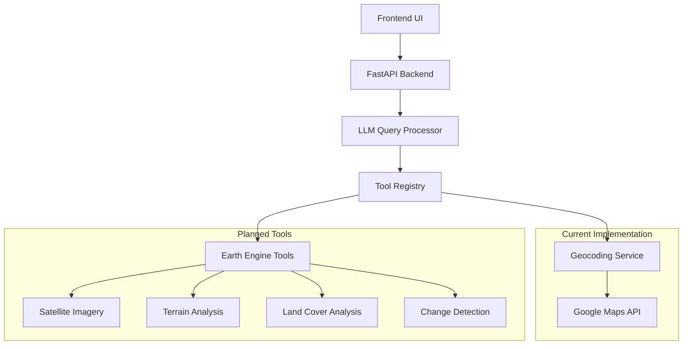
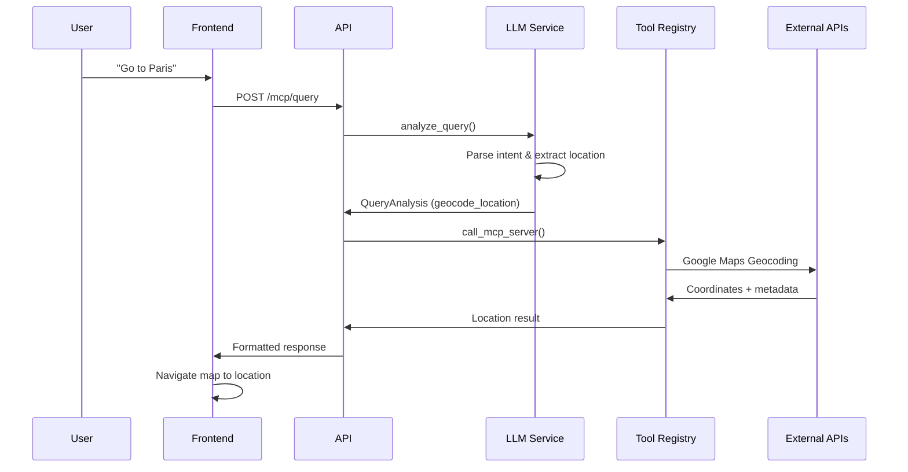
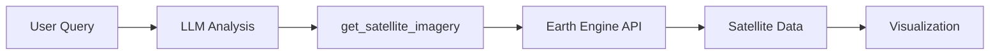

# Kadal Agent Architecture Design

This document outlines the architecture and design of the Kadal intelligent agent system, which powers natural language location queries and will expand to support complex Earth Engine operations.

## Overview

Kadal uses a sophisticated agent architecture that combines Large Language Models (LLMs) with geospatial tools to understand user intent and execute appropriate actions. The system is designed for extensibility, allowing for the addition of new Earth Engine capabilities over time.

## Current Architecture

### System Components



### Request Flow



## Core Components

### 1. LLM Query Processor

**Location**: `tender_tales/services/llm_service.py`

The heart of the agent system, responsible for:
- Analyzing user queries for intent and scope
- Extracting location names and parameters
- Determining appropriate tool calls
- Generating response templates

**Key Features**:
- Uses Claude 3.5 Sonnet for robust language understanding
- Structured output with Pydantic models
- Comprehensive prompt engineering for location extraction
- Graceful error handling and fallbacks

```python
class LLMQueryProcessor:
    def analyze_query(query: str, region: Dict) -> QueryAnalysis:
        # 1. Parse user intent
        # 2. Extract location parameters
        # 3. Determine tool calls
        # 4. Generate response template
```

### 2. Tool Registry System

**Location**: `tender_tales/api/routes.py:150-171`

A flexible system for registering and executing geospatial tools:

```python
tool_handlers = {
    "geocode_location": _handle_geocode_location,
    # Future tools will be added here
}
```

### 3. Data Models

**Core Models**:
- `ToolCall`: Represents a tool invocation with parameters
- `QueryAnalysis`: Complete analysis result from LLM
- `MCPQueryRequest`: Incoming user request structure

## Current Capabilities

### Location Understanding

The current implementation excels at location-based queries:

**Supported Query Patterns**:
- "Go to [location]"
- "Navigate to [location]"
- "Show me [location]"
- "Take me to [location]"
- "Find [location]"

**Location Extraction Logic**:
```
"Go to New York City" → location_name = "New York City"
"Navigate to Amazon rainforest" → location_name = "Amazon rainforest"
"Show me Tokyo" → location_name = "Tokyo"
```

**Geocoding Flow**:
1. LLM extracts location name from natural language
2. Google Maps Geocoding API resolves to coordinates
3. Response includes formatted address, coordinates, and zoom level
4. Frontend navigates map to the location

## Architecture Benefits

### 1. Modular Design
- Clean separation between LLM reasoning and tool execution
- Easy to add new Earth Engine capabilities
- Pluggable tool system

### 2. Robust Error Handling
- Graceful degradation when APIs are unavailable
- Comprehensive logging for debugging
- User-friendly error messages

### 3. Scalable Foundation
- Agent pattern ready for complex multi-step workflows
- Structured data models for consistent interfaces
- Extensible prompt system for new capabilities

## Roadmap: General Earth Engine Agent

### Phase 1: Enhanced Location Intelligence (Current)
- ✅ Natural language location queries
- ✅ Geocoding with Google Maps integration
- ✅ Interactive map navigation

### Phase 2: Satellite Imagery Analysis


**Planned Tools**:
- `get_satellite_imagery`: Fetch satellite imagery for regions
- `analyze_land_cover`: Classify land use types
- `detect_changes`: Compare imagery across time periods

### Phase 3: Complex Geospatial Analysis
**Advanced Capabilities**:
- Multi-dataset analysis workflows
- Time series analysis
- Environmental monitoring
- Custom visualizations

**Example Future Query Flow**:
```
User: "Show me deforestation in the Amazon from 2020 to 2024"
↓
LLM: Analyze → ["geocode_location": "Amazon", "get_forest_cover": {...}, "detect_changes": {...}]
↓
Tools: Execute geocoding → imagery retrieval → change detection
↓
Response: Interactive visualization with deforestation metrics
```

### Phase 4: Intelligent Workflows
- Multi-step analysis chains
- Data export capabilities
- Custom reporting
- Integration with external datasets

## Technical Considerations

### LLM Integration
- **Model**: Claude 3.5 Sonnet (high reasoning capability)
- **Temperature**: 0.1 (consistent, focused responses)
- **Structured Output**: JSON schema validation
- **Prompt Engineering**: Comprehensive system prompts with examples

### Tool Architecture
- **Registry Pattern**: Dynamic tool discovery and execution
- **Async Support**: Non-blocking tool execution
- **Parameter Validation**: Type-safe tool parameters
- **Error Isolation**: Failed tools don't crash entire system

### Future Enhancements
- **Tool Composition**: Chain multiple tools for complex analysis
- **Caching**: Optimize repeated Earth Engine queries
- **Streaming**: Real-time updates for long-running analysis
- **Batch Processing**: Handle multiple locations/time periods

## Security & Performance

### Current Safeguards
- Input validation on all user queries
- API key management through environment variables
- Rate limiting through external API quotas
- Comprehensive logging for audit trails

### Planned Improvements
- Request rate limiting
- Result caching for common queries
- Query optimization for Earth Engine
- User authentication and usage tracking

## Conclusion

The Kadal agent architecture provides a robust foundation for intelligent geospatial analysis. The current location understanding capabilities demonstrate the system's potential, while the modular design ensures smooth expansion to complex Earth Engine operations.

The combination of advanced language understanding, structured tool execution, and extensible architecture positions Kadal to become a comprehensive geospatial intelligence platform.
